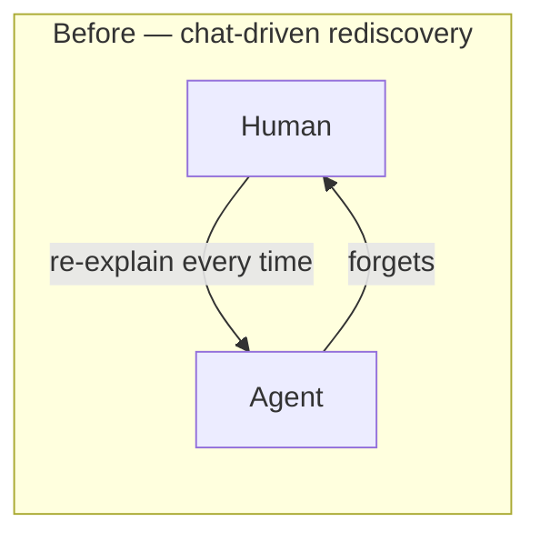
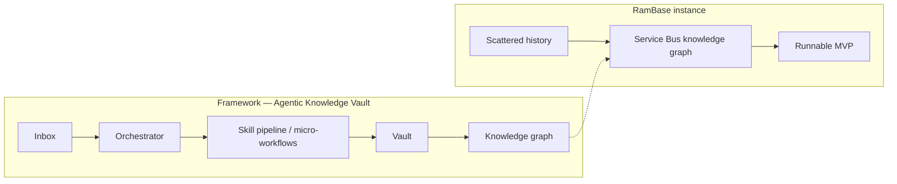
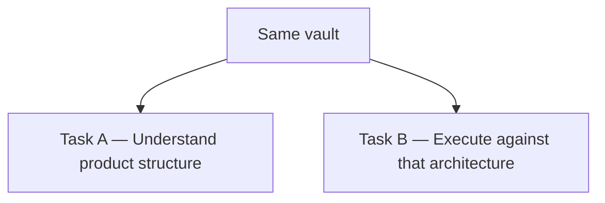

# ELEVATE 2026 — Solution Writeup

---

# Team Name: ඇයි Hack

**Project Team:** Hatteland (RamBase Service Bus)

**Team Members:** Samudra Kanankearachchi, Hashan Wanniarachchi, Sachith Jayasinghe, Obhasha Priyankara, Raashid Ahamed, Sahan Jayasinghe, Buddhima Nettasinghe, Selaka Nanayakkara

**Elevator Pitch:** From vibe coding to durable execution — we proved it on RamBase Service Bus. The Agentic Knowledge Vault is the pattern; Service Bus is the working example.

**Solution Type:** Skill or plugin on an existing coding agent (Cursor) — a reusable vault framework (skills + micro-workflows + knowledge graph), Cursor rules, and a Service Bus MVP that proves execution.

---

## 1. Problem Identification

**SDLC step owned by the solution:** design (architecture literacy), with downstream **build** executed from that knowledge

**The pain, before this solution:**

We were productive with vibe coding. The wall appeared when **every new task still needed a fresh dump of context**. That tax showed up in five places (as presented):

1. **No durable contextual understanding** — context died with the chat.
2. **Scattered Confluence and people** — hard to grab; lived in exports and heads.
3. **Hidden dependencies** — events, webhooks, and the Service Bus were only partially visible.
4. **Partially manual** — re-read wiki, re-explain to the agent, hope the next session remembered.
5. **Time-consuming rediscovery** — especially reconstructing how RamBase events, webhooks, and the Service Bus actually worked.

A knowledge base alone would not have fixed this. A knowledge base is **content — like a book**. Retrieve is not enough. Execute is the point.

**Who feels this pain:**

| Who | How the pain shows up |
|---|---|
| Hatteland / RamBase engineers and architects | Re-learning the bus for Service Bus 2.0 |
| New joiners and coding agents | No durable onboarding; context dies with the chat |
| Downstream partner integrators | Event → webhook contract must not break |
| The client program | Modernization stalls on tribal knowledge, not on “can we write C#” |

**Why this problem:**

Everyone is vibe coding. Velocity was high. The trigger was subtler: we were re-teaching the same product reality over and over. We could have skipped the vault and coded a demo broker first — faster on day one, wrong on day five, because the program constraint is **zero disruption** to existing webhook flows. Durable product understanding sits in front of every design and build decision.

---

## 2. Measurement

**Baseline (before):**
Chat-driven rediscovery. Product knowledge lived in 44 raw intake exports and people’s heads. Every new agent session needed a fresh dump of Service Bus context. No durable model; no local event→webhook spine.

**Result (after):**
Operating model changed: Inbox → skills → graph → execute. The same corpus is now a structured vault (90 notes), a diagram library, and a Docker MVP. Later sessions answered from the vault instead of re-ingesting Confluence. Vault bootstrap (30 Jul) to a three-UI Docker demo (3 Aug) was four calendar days, including a WSL delay.

| Metric | Before | After |
|---|---|---|
| Operating model | Chat-driven rediscovery; re-explain every time | Inbox → skills → graph → execute |
| Onboarding a new agent session | Re-dump Confluence (hours) | Agent guide + vault maps (minutes) |
| Structured, linked knowledge | 0 synthesized notes; 44 raw intake files | 90 vault notes + typed graph |
| Runnable event → webhook proof | Legacy Windows service only | Docker MVP (control panel, source, partner inbox) |
| Observable work history | Chat threads only | Logged requests across sessions |

**How this was measured:**
File counts from the repo. Dates from session logs. Calendar span is not a timed A/B study. Demo evidence: two live asks we presented — a domain question against the vault, then a governed vault improvement.

---

## 3. Solution Design

**What the solution does:**

**Core thesis (as presented):** a knowledge base by itself is a book — static reference. What we needed is **Skills + Micro-workflows + Knowledge**: a matured architect that can execute.

**Before:** chat-driven rediscovery — re-explain, regenerate, hope the agent remembered.
**After:** Inbox → skills / micro-workflows → knowledge graph → execute.
Same goal — get work done. Different operating system.

The **Agentic Knowledge Vault** is the reusable pattern. RamBase Service Bus is the instance:

| Layer | Role |
|---|---|
| Framework | Inbox → Orchestrator → Skill pipeline → Vault → Graph |
| Evidence | Scattered historical Confluence (read-only; we synthesize, never bulk-copy) |
| Instance | Structured Service Bus knowledge graph |
| Outcome | Runnable MVP built with that understanding |

The skill pipeline is a set of **governable micro-workflows** (intake, classify, retrieve, plan, generate, link, validate, review, and others as the domain needs). The set is not a fixed headcount — skills are added or adapted; authority stays bounded. Not one free-form agent.

The graph is typed (requires, depends_on, uses, validates). It builds up, evolves, and is used inside **long-horizon** work — not only one-shot Q&A.

**Two kinds of work, same vault:**

| | Verb | Meaning |
|---|---|---|
| **Task A** | Understand | Underlying structure of the existing product |
| **Task B** | Execute | Tasks against that architecture (including the MVP) |

Breakthrough we presented: **long-running tasks are possible when context is durable.** We do not need continuous vibe-code step guidance for every move.

**Live demo (as presented):** (1) a domain question about RamBase Service Bus from the vault — answer from structured knowledge, not vibes. (2) ask for an improvement to the vault — a governed structured update. Watch for understanding plus action.

**Why this approach:**

| Option we considered | Why we did not stop there |
|---|---|
| One free-form coding agent + giant prompt | Fast, ungoverned, forgets |
| Knowledge base / RAG dump of Confluence | Still a book — retrieve without execute |
| Code the MVP with no vault | Demo without a contract; knowledge still scatters |

**How it fits into the delivery flow:**

It sits **upstream of build** on Service Bus 2.0. Understand the product, then execute on it. Architects use the vault for concerns and use cases. The prototype is the spine (source → bus → partner webhook), not a production cutover. Cursor rules keep the next session inheriting context.

**Design diagram (mandatory):**

**Trigger & Human Oversight:**

- Trigger: **manual invocation** (human asks Cursor; Inbox drop starts the skill path)
- Human-in-the-loop: **approval gate** — auto-apply for low-risk cleanup; human/expert approval for decisions, policies, and anything that changes real behaviour

**Execution Environment:**

- Environment: **local machine** (Cursor agent + Obsidian-compatible vault) and **containerized** (Docker Compose MVP)

We presented this as a 6–8 minute RamBase pitch with live demo, and as a 10 minute framework pitch. **Takeaways we closed with:** durable context beats re-prompting. Skills plus a knowledge graph give executable architecture literacy. Evaluate the pattern — RamBase Service Bus is the proof instance, not the whole story.

---

## 4. Implementation Details

**Tools/stack used:**
Cursor (agent + workspace rules); Obsidian-compatible Markdown vault; skill specs and micro-workflows; .NET 8; RabbitMQ; Postgres; Docker Compose.

**Key technical decisions:**
Skills as governed micro-workflows, not one unbounded agent — the skill set can grow. Isolate legacy knowledge from the modernization chapter. Synthesize intake evidence — never bulk-copy. RabbitMQ is the MVP broker; production broker remains open.

**Repo/code link:**
https://github.com/sachithsujeewa/service-bus.git

---

## Optional: What we'd do with another week

- Close the production **broker decision** with a scored POC — RabbitMQ is MVP-only today.
- Wire Inbox processing to an orchestrator so it can be event-driven, not only on-demand in Cursor.
- Gold-set architecture questions with citation checks against vault notes.
- Harden the MVP: metrics baseline, default HMAC, DLQ operator UX.

---

## Optional: Non-goals / scope boundaries

- **Not a production cutover.** No multi-host HA or GitOps fleet.
- **Not a wholesale Confluence migration.** Intake stays read-only evidence.
- **Not merging legacy and target architecture.** Chapter isolation is a feature.
- **Not a frozen skill catalogue.** Skills are micro-workflows we add as the domain needs; we do not treat a headcount as the product.
- **Not replacing human architects.** Agents retrieve, draft, and execute inside gates; people own contracts and go/no-go.
