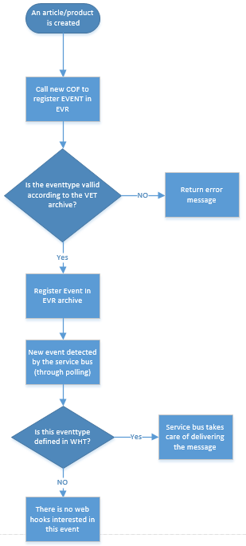

# DataModel
We will need the following RamBase archives

# **EVR (Event register)**

This is an archive where all events are registered. **This is a global Archive.**

| FieldName | DataType | TNO | DESCRIPTION |
| --- | --- | --- | --- |
| CS | CS | 00 |  |
| NO | Key#NO | 00 |  |
| DB | STRING | 00 |  |
| EVENTTYPE | STRING | 00 | eg. ITMSHIPPED / ARTCREATED. This value has to be registered in the VET archive to be valid. |
| REGTIME | DATETIME | 00 | Contains date and time |
| KEY | STRING | 08 | A field name. eg. DOCID |
| VALUE | STRING | 08 |  |

### Example data

| NO | DB | EVENTTYPE | REGTIME |
| --- | --- | --- | --- |
| 10001 | JHC-NO | ItmShipped | 2013.01.01 23:10:14 |
|  | KEY OrderNo ItmNo | VALUE 34343 4 |  |
| 10002 | SKA-NO | ArticleCreated | 2013.01.01 23.10:19 |
|  | KEY SKU | VALUE 10023 |  |

# **VET (Valid EventTypes)**

List all valid event types with a description of each type. **This is a Global Archive.**

| FieldName | DataType | TNO | Description |
| --- | --- | --- | --- |
| CS | CS | 00 |  |
| NO | KEY#NO | 00 |  |
| EVENTTYPE | STRING | 00 |  |
| KEY | STRING | 08 | Parameter Field Name |
| DATATYPE | STRING | 08 | Parameter Datatype |
| ISREQUIRED | BOOL | 08 | Is the parameter required? |
| DESCR | STRING | 09 | Long description of event type |

### Example Data

| EVENTTYPE | DESCRIPTION |
| --- | --- |
| ItmShipped | This event will occur when an order item is shipped to customer. It will have to parameters: OrderNo and ItmNo |
| ProductCreated | This event will occur when a new article is created. It will have one parameter: SKU |
| ProductUpdated | This event will occur when an article is updated. It will have one parameter: SKU |
| ProductClassChanged | This event will occur when the CLASS field is changed on an article. It will have three parameters: SKU, OldClass, NewClass |

# **WHT (Web Hook Type)**

This archive contains a list of all EventTypes that are valid for use as web hooks.

| FieldName | DataType | TNO | Description |
| --- | --- | --- | --- |
| CS | CS | 00 |  |
| NO | KEY#NO | 00 |  |
| EVENTTYPE | STRING | 00 | eg. ITMSHIPPED / ARTCREATED. This value has to be registered in the VET archive to be valid. |
| APIURL | STRING | 08 | The api URL we will use to get the data we need to forward to the customer. This value will be copied to the WHA archive when a new WHA document is created. |
| FRIENDLYNAME | STRING | 08 | Instead of presenting the API url to the customer we need a friendly name of it |
| DESCRIPTION | STRING | 08 | Description of what kind of data is returned by the APIURL |

### Example data

| CS | NO | EVENTTYPE |  |
| --- | --- | --- | --- |
| 12434DFSWEWSY | 10000 | ItmShipped |  |
|  | APIURL /sales/orders/{OrderNo}/items/{ItemNo} /webhooks/itmshipped | FRIENDLYNAME All item details Key fields from item | DESCRIPTION Will give you all the item details Will give you just the key fields from the item: orderno, itemno, sku, qty |
| 467835FGJHGEE4 | 10001 | ProductCreated |  |
|  | APIURL /products/{SKU} | FRIENDLYNAME All product details | DESCRIPTION Will give you all details of this product |

# **WHA (Web Hook Archive)**

This is the archive where the Customers register which Web Hooks they are interested in. **This is a Global Archive.**

| FieldName | DataType | TNO | Description |
| --- | --- | --- | --- |
| CS | CS | 00 |  |
| NO | KEY#NO | 00 |  |
| DB | STRING | 00 | This webhook will just trigger on event in the same database. |
| EVENTTYPE | STRING | 00 | This is the eventtype the web hook will react on. This value has to be registered in the WHT archive to be valid |
| POSTURL | STRING | 00 | The URL the customer want us to POST to This URL can include macros eg. https://hatteland-display.com/s/rambase/shipped?ordnerno={orderno} |
| FORMAT | STRING | 00 | XML/JSON |
| APIURL | STRING | 00 | The api URL we will use to get the data we need to forward to the customer. This URL can include macros eg. sales/orders/{orderno}/items/{itemno} This field is copied from the WHT archive, but it is important to understand that the APIURL can be left empty. |

### **Example Data**

| NO | DB | EVENTTYPE | POSTURL | FORMAT | APIURL |
| --- | --- | --- | --- | --- | --- |
| 10002 | SKA-NO | ProductCreated | https://services.skanfil.no/products | XML | /products/{SKU} (In this case SKU is a macro that will be replaced by the SKU value from EVR) |
| 10003 | DIS-NO | ItmShipped | https://hatteland-display.com/s/rambase/shipped | JSON | /sales/orders/{OrderNo}/items/{ItemNo} |

**Result of a web hook in xml format:**

```
<WebHook>

	<EventType>ItmShipped</EventType>

	<EventRegisteredTime>2013-06-06 12:05:01</EventRegisteredTime>

	<Parameters>

		<OrderNo>33232</OrderNo>

		<ItemNo>4</ItemNo>

	</Parameters>

	<Content>

		-- The complete content returned from the APIURL resource. If APIURL is NULL then there will be no content.

	</Content>

</WebHook>
```

# 

Open 
