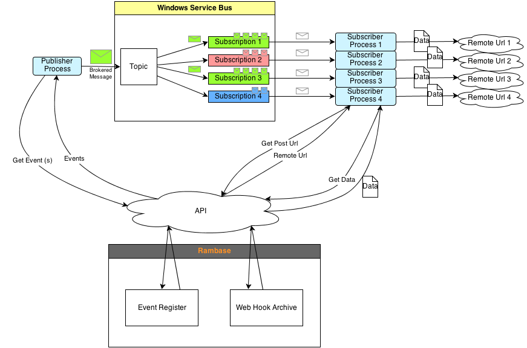
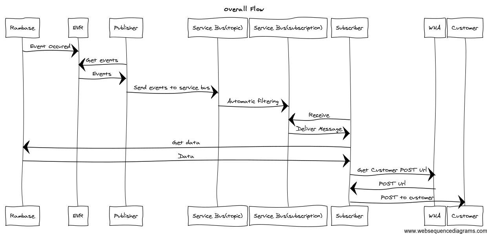

# Design
- 1 [Overview](./Design.md#Overview)
- 2 [Rambase](./Design.md#Rambase)
  - 2.1 [Event Register (EVR)](./Design.md#Event-Register-(EVR))
  - 2.2 [Web Hook subscription Archive (WHA)](./Design.md#Web-Hook-subscription-Archive-(WHA))
- 3 [Windows Server](./Design.md#Windows-Server)
- 4 [System Flow](./Design.md#System-Flow)
  - 4.1 [Prerequisites](./Design.md#Prerequisites)
  - 4.2 [Rambase flow](./Design.md#Rambase-flow)
  - 4.3 [Publisher flow](./Design.md#Publisher-flow)
  - 4.4 [Subscriber flow](./Design.md#Subscriber-flow)
- 5 [Output Example To Customer (end point)](./Design.md#Output-Example-To-Customer-(end-point))
- 6 [Example](./Design.md#Example)
  - 6.1 [Starting conditions](./Design.md#Starting-conditions)
  - 6.2 [Flow](./Design.md#Flow)

# Overview

Open [http://www.draw.io](http://www.draw.io/) Loading file... Loading file...

# Rambase

Loading file...

### Event Register (EVR)

All events are put into the EVR.

Each line is a single event, containing a unique event ID.

| EventID | EventType | Database | Date | Time | Params (Table1) | ... |
| --- | --- | --- | --- | --- | --- | --- |
| 0 | PriceChanged | TST-NO | 130529 | 13:00 | Key Value isPublic orderno 12345 true itemno 12346 true |  |
| Key | Value | isPublic |  |  |  |  |
| orderno | 12345 | true |  |  |  |  |
| itemno | 12346 | true |  |  |  |  |
| 1 | Rambase2Jira | TST-NO | 130529 | 13:00 |  |  |

WebHookType

| EventType list | PostUrl list | API resource Url list |
| --- | --- | --- |
| ItemShipped |  |  |

### Web Hook subscription Archive (WHA)

The Web Hook subscription Archive contains information about the subscriptions.

Each line is a single subscriber, containing the customer name, the events (filter) that the subscriber is interested in, and a Post Url, to which the data is to be sent.

The filter for the service bus subscription for Hattelco is equivalent to** eventtype='PriceChanged'**.

**Topic + Subscription**: Identifier

**Customer**: Not really necessary for functionality, but can be nice to have so that we know who it belongs to

**EventType**: The filter to use in the Service Bus.

**Method**: How to send the information to the endpoint.

**PostUrl**: The Url to send the data

**PID**: The process ID of the subscriber process that handles the subscription

**Active**: True if the subscription is active, else false

**ApiResource**:

Authenticaiton?

| CUS:Customer | EventType:EventType | String:PostUrl | String:Format | Boolean:Active | Link to API Resource URL |
| --- | --- | --- | --- | --- | --- |
| Hattelco | PriceChanged | http://api.hattelco:8082 | XML | true | RES/65 |
| BuyInBulk | ItemShipped | http://api.buyinbulk.com:8081 | JSON | false | RES/65 |

# Windows Server

A server that runs Windows service bus, a publisher and subscribers.

**The publisher** is a (one) process that runs on the server. The job of the publisher is to get events from the EVR, and send the events to the service bus as BrokeredMessages. The publisher keeps track of which event from the EVR that was most recently processed.

**The Windows Service Bus** consists of topic(s) and subscriptions.

- A **topic** is the entrance point for messages to the service bus. A topic can be associated with one or more subscriptions.
- A **subscription** is a queue in the Windows Service Bus. A subscription is associated with a single customer endpoint. A subscription have one or more filters. All messages that are sent to the topic are distributed and copied to the subscriptions where the filters match.

**The Subscriber** is a process that is associated with a subscription. The subscriber reads messages from the subscription, gets the appropriate data from Rambase via Rambase API and posts the data to the customer, and keeps track of the Url to post to via the archive WHA.

The job of the subscriber is to make sure that the filter is updated in the service bus. This information can be polled from the WHA regularly (every 10 minutes or so?). The job of making sure that the subscriptions are updated could be handled by a **separate process** to limit the number of accesses to the WHA.

# System Flow

### Prerequisites

1. The publisher is active all the time.
2. A subscriber for each subscription is active all the time

### Rambase flow

1. Something occurs in Rambase. (A price was changed / A new ART was added / ...)
2. The event is registered in the EVR, containing information such as EventType, Database, Customer, Time, Rambase resource, ....

### Publisher flow

1. Poll for new events from the EVR regularly.
  1. For each event ***event ***that is received from the EVR:
    1. A "BrokeredMessage" ***msg** *is created, having contents equal to ***event***
    2. ***msg ***is sent to the Service Bus
    3. latest published message counter is incremented to match ***event***, making it possible to shutdown / restart and continue where it left off.

### Subscriber flow

1. Try to receive message ***msg*** (first message in queue) from subscription
  1. Based on the information in ***msg***: get the data from Rambase
  2. Get customer Post URL from WHA
  3. Try: Post data to Customer Post URL
    1. if failed
      1. mark ***msg*** as abandoned (this ensures that this message will be the next message to be received from the subscription)
      2. sleep
    2. if success
      1. mark ***msg*** as completed (removing the message from the Service Bus subscription)

Open [http://www.websequencediagrams.com](http://www.websequencediagrams.com/)

title Overall Flow

Rambase->EVR:Event Occured
Publisher->EVR:Get events
EVR->Publisher:Events
Publisher->Service Bus(topic): Send events to service bus
Service Bus(topic) -> Service Bus(subscription): Automatic filtering
Subscriber->Service Bus(subscription): Receive
Service Bus(subscription)->Subscriber: Deliver Message
Subscriber->Rambase: Get data
Rambase->Subscriber: Data
Subscriber->WHA: Get Customer POST Url
WHA->Subscriber: POST Url
Subscriber->Customer: POST to customer

# Output Example To Customer (end point)

{

"EventId": "0",

"EventType": "ItemShipped",

"Database": "TST-NO",

"Date": "2013-06-10",

"Time": "21:10",

"Parameters": [

{

"ParameterName": "Orderno",

"ParameterValue": "12345"

},

{

"ParameterName": "NumberOfItems",

"ParameterValue": "5"

}

],

"Content": {

"orderItems": [

{

"orderNumber": 140729,

"orderItemNumber": 1,

"orderDate": "2013-06-07",

"sKU": "#135459",

"partNumber": "132test",

"partDescription": "Tortest",

"customerOrderNumber": ""

}

],

"paging": {

"position": "1"

}

}

}

# Example

Here, an example is presented to give a more concrete overview.

### Starting conditions

The Publisher is running and has processed all events with eventID <= 19831. The publisher polls for new events every second.

The WHA contains the data that can be seen in the WHA above. This means that the the service bus contains the following subscriptions:

1. a subscription with the filter **customer='Hattelco' AND eventtype='PriceChanged'**
2. a subscription with the filter **customer='BuyInBulk' AND eventtype='ItemShipped'**

Two subscriber processes are running.

1. A subscriber for the Hattelco subscription
2. A subscriber for the BuyInBulk subscription

### Flow

1. Price is changed for ART 113050
2. The event is stored in the EVR as a new line (19832, PriceChanged, TST-NO, Hattelco, 20130530, 09:00, ART, 113050)
3. The publisher polls for new events, and receives event with ID 19832.
4. The publisher converts the table entry into a dictionary and creates a BrokeredMessage, containing the dictionary.
5. The publisher sends the message to the service bus.
6. (within Service Bus: ) Since customer='Hattelco' AND eventtype='PriceChanged' matches the dictionary in the message, the message is transfered to the Hattelco subscription
7. The publisher increments the latest processed event ID to match 19832.
8. The Hattelco subscriber receives the message, and reads the customer and eventtype.
9. If the Hattelco subscriber has not cached the Post Url (http://api.hattelco.com:8082, it requests the Post Url from the WHA.
10. The Hattelco subscriber requests the required data from the Rambase API (ART/#113050)
11. The Hattelco subscriber Posts the data to the customer Post Url.
