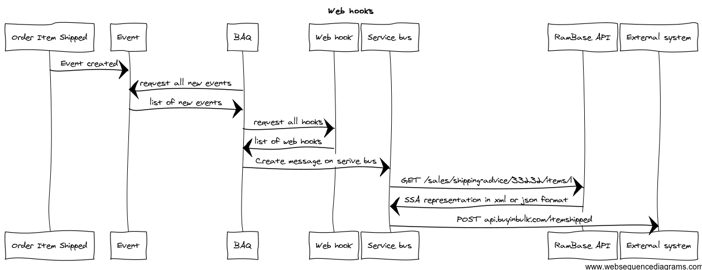

# How RamBase could support web hooks
Definition of web hooks: [http://en.wikipedia.org/wiki/Webhook](http://en.wikipedia.org/wiki/Webhook)

To make it short, a web hook is the ability to send a http post to an external system - triggered by an event. An example of a such event could be when an order is shipped.The http post is then a way of pushing this information to an external system.

## How could we solve this in RamBase?

Create a new event archive in RamBase like this (simplified example):

| EventType | Customer | Param1 | Param2 |
| --- | --- | --- | --- |
| ItemShipped | BuyInBulk | SSA | 10002-1 |
| OrderCanceled | Hattelco | COA | 434335 |
| NewArticle | BuyInBulk | ART | 454242 |

Events are written to this archive in real-time when they happen.

Also create a new event-hook archive like this (simplified example):

| EventType | PostUrl | ApiResource | Customer |  |
| --- | --- | --- | --- | --- |
| ItemShipped | https://api.buyinbulk.com/itemshipped?access_toke=343435asdfe32fsssdfdsfew_sere_wer | RES/65 | BuyInBulk |  |
| ItemShipped | https://integration.hattelco.com/shippeditem?secret=rrdffffs!!222222222 | RES/65 | Hattelco |  |

This archive contains a list of all url to post to when an event is fired. We could have a batch job running every minute to search the event archive for new events, and for each event found it could look up all the web-hooks registered for that event. Then it could add a message to a Microsoft Service Bus system ([http://msdn.microsoft.com/en-us/library/windowsazure/jj193022(v=azure.10).aspx](http://msdn.microsoft.com/en-us/library/windowsazure/jj193022(v=azure.10).aspx)). The Service bus will use our API to get the data it should push to the external system. By using a service bus system we can handle messages in a safe way, so that if a message could not be delivered to the external system, it can automatically try again until it get the message trough.

Open 
