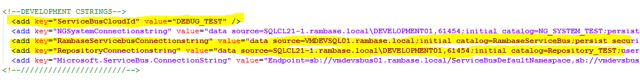
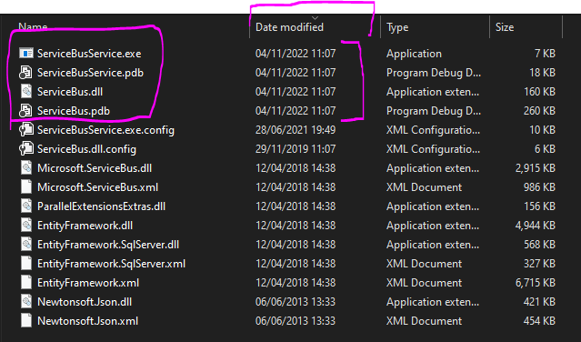

# Knowledge transfer 221117
# Production

Information about machines and databases in production environment can be found here: [https://rambase.atlassian.net/wiki/spaces/RBOP/pages/275710008](https://rambase.atlassian.net/wiki/spaces/RBOP/pages/275710008)

# Test environment setup (as in knowledge transfer session 221117)

## VMs ,databases & systems

### Servicebus VMs

#### VMDEVSBUS01.rambase.local

- Servicebus internal (installed with Microsoft Web Platform Installer)
  - Micorosoft Service Bus 1.1
- Developed by RamBase
  - RamBase Service Bus
- Misc
  - Visual Studio + other tools(for debugging)

#### VMDEVSBUS02.rambase.local

- Servicebus internal (installed with Microsoft Web Platform Installer)
  - Micorosoft Service Bus 1.1
- Developed by RamBase
  - RamBase Service Bus
- Misc
  - Visual Studio + other tools(for debugging)
  - SimpleWebServer
    - Tool that receives POST requests on `http://:7788*/testendpoint/` and prints them, easy way to debug a webhook if pointed towards it.

### Other

#### VMSTGGTW16.rambase.local (TEST13 gateway VM)

- Regular rambase gateway

### SQL Servers

#### vmdevsql01.rambase.local

- Databases
  - Servicebus internal databases (generated by servicebus / web platform installer)
    - SbGatewayDatabase
    - SbManagementDB
    - SBMessageContainer01
    - SBMessageContainer02
    - SBMessageContainer03
  - Developmed by RamBase
    - RambaseServiceBus
      - Backend database, used to track latest sent event for each system, cloud state synchroinization, cloud configuration

#### SQLCL21-1\DEVELOPMENT01

- Databases
  - Repository_TEST
    - Used by servicebus to figure out which systems it should be active for by checking `Repository_TEST.dbo.NGSystem.SB_ID` column for its configured ID (DEBUG_TEST)
  - NG_SYSTEM_TEST
    - Used by rbsystem-gateways to know which servicebus it should try and open a connection > send notification data to over tcp-socket when a new event has been created. `NG_SYSTEM_TEST.ngsys.Systems.ServiceBusAddress` + `NG_SYSTEM_TEST.ngsys.Systems.ListeningPort` are used for this.
  - TEST13
    - rb-system database for the test system used in the knowledge transfer
      - All `ST:4` documents in `TEST13.dbo.WHA*` are read by servicebus when webhooks are initialized.

## Configuration

Important details for the debug/development setup

### TEST13

#### VMSTGGTW16.rambase.local -  gateway VM

- odbc.ini configured towards NG_SYSTEM_13 & Repository_TEST

#### TEST13 - sql database

- VET
  - EventType for test created “JensTest” with only one parameter was used
- WHA
  - Webhook using “JensTest” event type was created and pointed towards SimpleWebServer on  VMDEVSBUS02 (can be anywhere reachable by VMDEVSBUS01)

### VMDEVSBUS01.rambase.local

- Rambase Service bus configuration
  - "C:\git\service-bus\ServiceBusService\bin\Debug\ServiceBusService.exe.config"
    - Setup to use Repository_TEST with ID= DEBUG_TEST and the RambaseServiceBus-backend-dbOpen 

### Repository_TEST

- NGSystem-table
  - Entry for TEST13 was added (if not already there)
    - SB_ID set to “DEBUG_TEST”

### NG_SYSTEM_TEST

- ngsys.Systems-table
  - Entry for TEST13 was added (if not already there)
    - ServiceBusAddress = “vmdevsbus01.rambase.local”
    - ServiceBusListeningPort = 7438

## Overview

Gliffy Diagram## How to release a new servicebus version

1. Check which files are updated after compilation in `service-bus\ServiceBusService\bin\Release`, usually its:

Open 
2. Log into the host which is to be updated (same for both ) with the sa-servicebus service account (check passwordstate)
3. Open an explorer window and go to `C:\RambaseServiceBus`
4. Make a zip of the files (above) thats about to be replaced and save it somewhere if rollback is needed
5. Open `services.msc` (use run or windows fancy menus)
6. Stop the RambaseServiceBus-service
7. Replace the files above with the new release
8. Start RambaseServiceBus-service again
9. Check the logs on SQLCL22-1\BACKEND01 …. RambaseServiceBus.dbo.Logs (order by idx desc and filter on the id of the servicebus that was updated to reduce clutter) that everything runs like intended.
