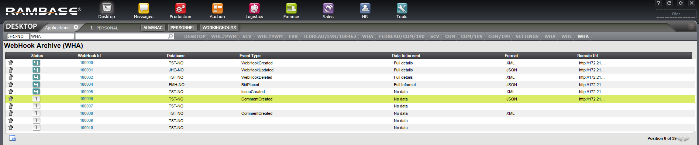
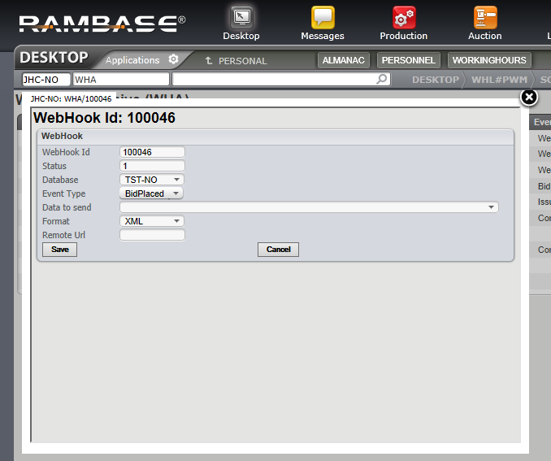

# User Documentation WHA
- 1 [Description of the WHA](./User Documentation WHA.md#Description-of-the-WHA)
- 2 [Create / Update a WHA record](./User Documentation WHA.md#Create-%2F-Update-a-WHA-record)

# Description of the WHA

In the app WHA a list of current webhooks are listed. Each row is a webhook. Here it is possible to create new webhooks, delete webhooks, change details of a webhook.

All events that occur within the same Database are guaranteed to be delivered in the order they occured.

A webhook defines what type of event to trigger on, and when one such event occurs, it should be sent to an Url. It is possible to send extra data by setting the "Data to be sent" field. This will cause an API resource to be retrieved and the result is embedded with the event information.

All events of the defined Event Type that occur in the same database as the webhook is sent to the defined Remote Url. If an API resource is chosen (in the Data to be sent field), that API resource is called and the result is also sent to the remote Url in the same message.

Multiple webhooks can have the same Remote Url in cases where multiple event types are to be sent to the same server.

Open The columns to be seen are described below

| Column | Description |
| --- | --- |
| Status | The status of the webhook. If this is set to 4 it is considered as active. If it is set to any other value, it is considered inactive. |
| WebHookid | The unique identification number for a specific WebHook |
| Database | The database that this webhook is related to. The value must be a valid database. |
| Event Type | The event type for the webhook. The Event type decides which events to use as a trigger for the webhook. |
| Data to be sent | This field is set when additional information needs to be sent to the Remote Url. This is an API resource which is accessed before the POST to the Remote Url takes place. The contents of the result from the API resource is placed together in the contents of the data to send to the Remote Url. |
| Format | The format in which to send to the Remote Url. This value can be either XML or JSON. Examples of the structure of the formats can be seen below. EventID, EventType, Database, RegisterTime are always present. Parameters are present if the Event itself contains parameters. Content only exists if an API resource has been called (if "Data to be sent" is set). The result from the API resource is placed within Content. JSON XML |
| Remote Url | This is the Url to which we send the event information to. The Url must be able to receive Http POST messages. |

# Create / Update a WHA record

WHA records (Web Hooks) are edited in the WHA app. To create a new record, the  button can be used. To edit an already existing Web Hook, mark the record to edit and click enter, or just click the WebHook Id to get into edit mode.

Open 

When creating or updating a Web Hook, some fields can only be set to predefined values. These are **Database**, **Event Type**, **Data to send** and **Format**. This is to limit the number of places where things can go wrong. For a description of each field, see section above.

The **Webhook Id** is locked. This is because it must be unique, and there is no reason to change it.

Status is important to set to 4 if it should be activated. This will cause all events of the type defined in **Event Type** that match the** Database** to be sent to to the **Remote Url**.

## Child pages

- [[User Documentation WHA/WebHooks Output Format]]
