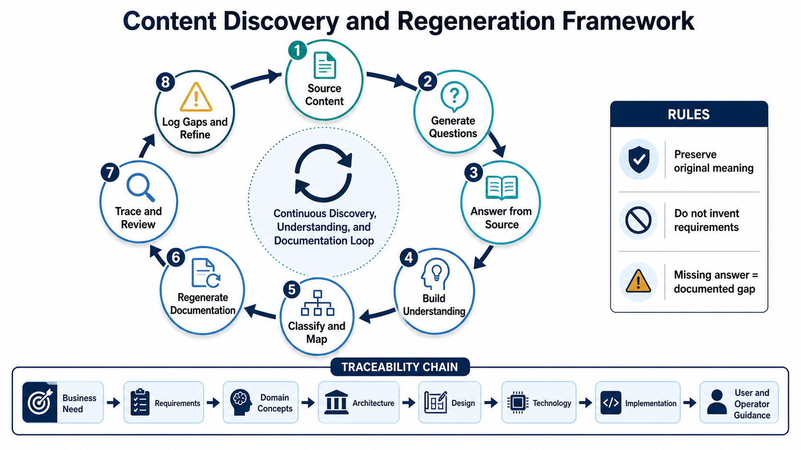

# Webhook and Event Documentation Rediscovery

## Purpose

Rediscovery means understanding the existing RamBase event, webhook, and Service Bus pages and reorganizing the **same meaning** into a professional documentation structure. It does not mean inventing new product requirements or silently redesigning the system.

## Desired structure

`Business need → business requirements → system requirements → domain concepts → architecture → design → technology → implementation → user and operator guidance`

Maturity shows how completely each documentation layer is expressed. Traceability shows how an original statement connects across those layers.

## Why, what, how

- **Why:** Extract the documented business problem, purpose, stakeholders, value, scope, and constraints.
- **What:** Extract the behaviour, rules, capabilities, data, and requirements already stated in the source.
- **How:** Reorganize the documented architecture, design, technology, implementation, and operating procedures that realize the “what.”

## Core rules

- Preserve original intent and requirement strength.
- Do not turn a suggestion, possibility, or question into a requirement.
- When the source is silent, write **Not specified in source documentation** and log a gap.
- Separate original content, editorial clarification, external validation, and future ideas.
- Consolidate duplicates without losing source provenance.
- Retain the original archive unchanged as historical evidence.
- Never repeat credentials or secrets; use safe references and record that redaction occurred.

## Working documents

1. [[00-Target-Documentation-Structure]] — canonical hierarchy and source mapping.
2. [[01-Rediscovery-Charter]] — scope, principles, and completion criteria.
3. [[02-Discovery-Question-Bank]] — classification and clarification questions.
4. [[03-Maturity-Model]] — documentation completeness and traceability rubric.
5. [[04-Engineering-Refinement-Loop]] — page-by-page restructuring process.
6. [[05-Missing-Information-Register]] — information absent or unclear in the source.
7. [[06-Deliverable-Blueprint]] — professional writing and review rules.
8. [[07-Initial-Backlog]] — documentation restructuring work packages.
9. [[08-Decision-and-Traceability-Templates]] — source mapping and traceability templates.
10. [[09-Content-Discovery-and-Regeneration-Framework]] — content-derived questions and the question-to-document regeneration method.

## Framework visual

## Completion definition

Rediscovery is complete when every source page, section, table, diagram, image, example, link, and question is inventoried and mapped; the content is professionally rewritten without changing meaning; the layers are traceable; and all omissions, contradictions, unresolved source questions, and editorial choices remain visible.
