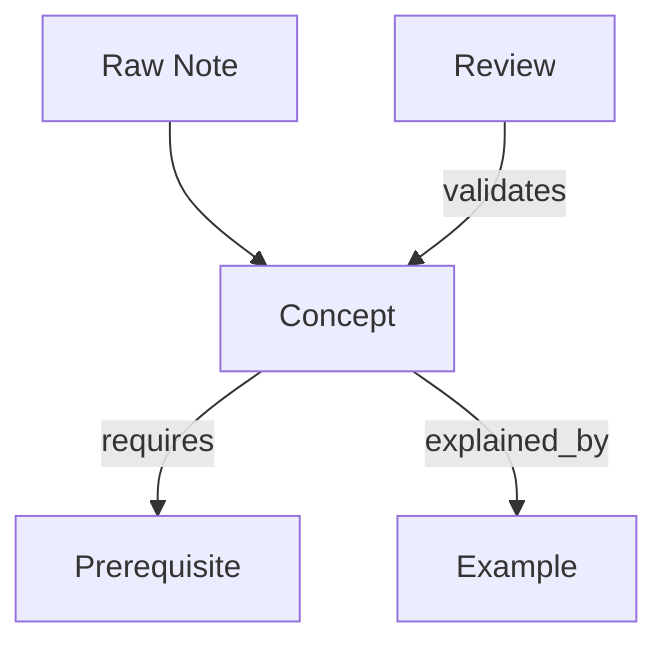

# Generic Knowledge Graph

This file can be updated manually or by an agent.

## Example


```mermaid
graph TD
    A[Raw Note] --> B[Concept]
    B -->|requires| C[Prerequisite]
    B -->|explained_by| D[Example]
    E[Review] -->|validates| B
```

## Relationship format

```markdown
- [[Source]] --relation--> [[Target]]
```
