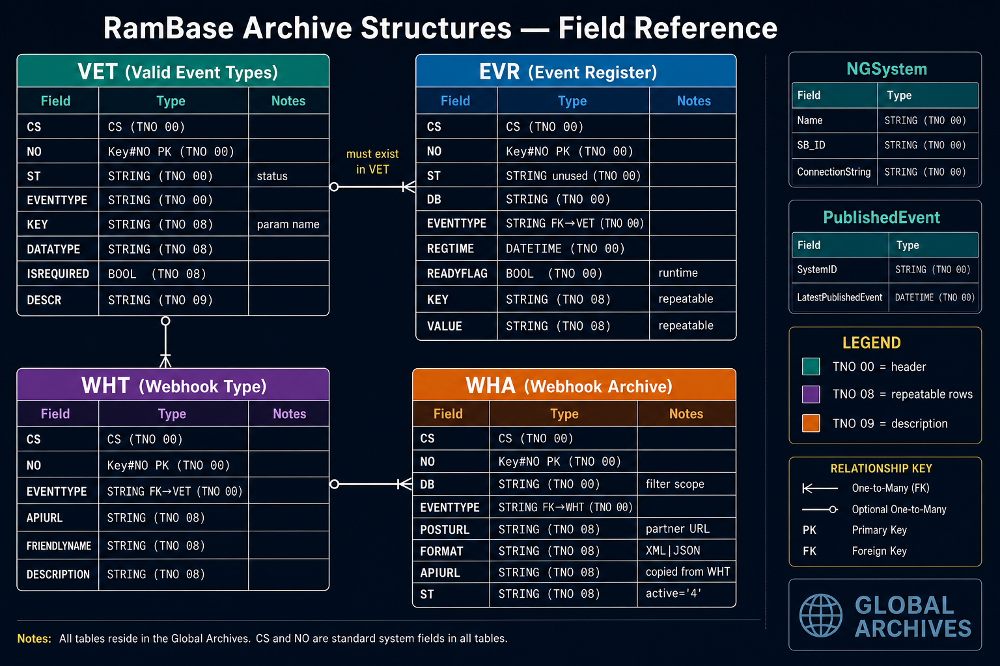

# RamBase Archive Structures — Field Reference



> **TNO legend:** `00` = header row · `08` = repeatable parameter rows · `09` = description row

## VET — Valid Event Types

| Field | Type | TNO | Notes |
|-------|------|-----|-------|
| `CS` | CS | 00 | Archive checksum |
| `NO` | Key#NO | 00 | **PK** |
| `ST` | STRING | 00 | Event type status |
| `EVENTTYPE` | STRING | 00 | e.g. `ItmShipped` |
| `KEY` | STRING | 08 | Parameter name |
| `DATATYPE` | STRING | 08 | Parameter type |
| `ISREQUIRED` | BOOL | 08 | Required param? |
| `DESCR` | STRING | 09 | Long description |

## EVR — Event Register

| Field | Type | TNO | Notes |
|-------|------|-----|-------|
| `CS` | CS | 00 | |
| `NO` | Key#NO | 00 | **PK** — becomes `RamBaseEventId` |
| `ST` | STRING | 00 | Unused |
| `DB` | STRING | 00 | Database scope |
| `EVENTTYPE` | STRING | 00 | **FK → VET** |
| `REGTIME` | DATETIME | 00 | Event timestamp |
| `READYFLAG` | BOOL | — | Runtime: publisher waits before publish |
| `KEY` | STRING | 08 | Param name (repeatable) |
| `VALUE` | STRING | 08 | Param value (repeatable) |

## WHT — Webhook Type

| Field | Type | TNO | Notes |
|-------|------|-----|-------|
| `CS` | CS | 00 | |
| `NO` | Key#NO | 00 | **PK** |
| `EVENTTYPE` | STRING | 00 | **FK → VET** (must be webhook-eligible) |
| `APIURL` | STRING | 08 | Data fetch template → copied to WHA |
| `FRIENDLYNAME` | STRING | 08 | UI label |
| `DESCRIPTION` | STRING | 08 | API description |

## WHA — Webhook Archive

| Field | Type | TNO | Notes |
|-------|------|-----|-------|
| `CS` | CS | 00 | |
| `NO` | Key#NO | 00 | **PK** |
| `DB` | STRING | 00 | Filter: same DB only |
| `EVENTTYPE` | STRING | 00 | **FK → WHT** |
| `POSTURL` | STRING | 00 | Partner callback URL (macros allowed) |
| `FORMAT` | STRING | 00 | `XML` or `JSON` |
| `APIURL` | STRING | 00 | Optional; from WHT |
| `ST` | STRING | — | Active when `'4'` |

## Control stores (non-ERP)

| Store | Key fields | Role |
|-------|------------|------|
| **NGSystem** | `Name`, `SB_ID`, `ConnectionString`, `SB_CLIENTID`, `SB_CLIENTSECRET` | System ↔ bus mapping |
| **PublishedEvent** | `SystemID`, `LatestPublishedEvent` | Publish cursor |

## Relationships

```text
VET ──defines──► EVR
VET ──defines──► WHT ──templates──► WHA
EVR.KEY/VALUE ──► message P_{key} properties ──► EventEnvelope.Parameters (MVP)
WHA.POSTURL ──► HTTP POST target
```

## Related

- [[data-architecture]]
- [[entity-model-archives-architecture]] (11-New-System mapping)
- Source: `_intake/old system/ArchtureDiscovery/DataModel.md`
