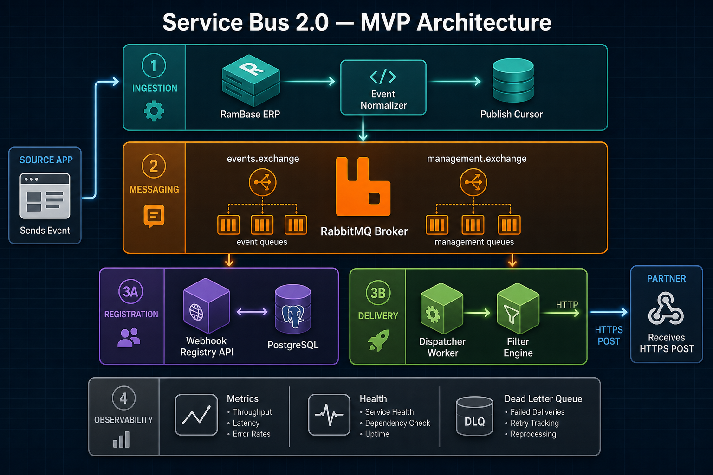
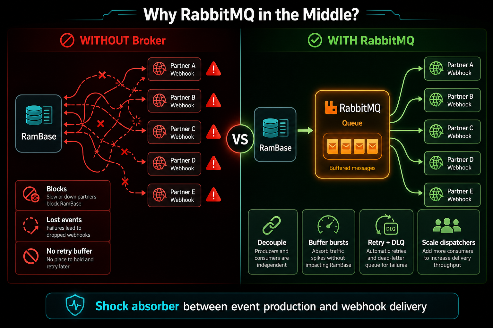
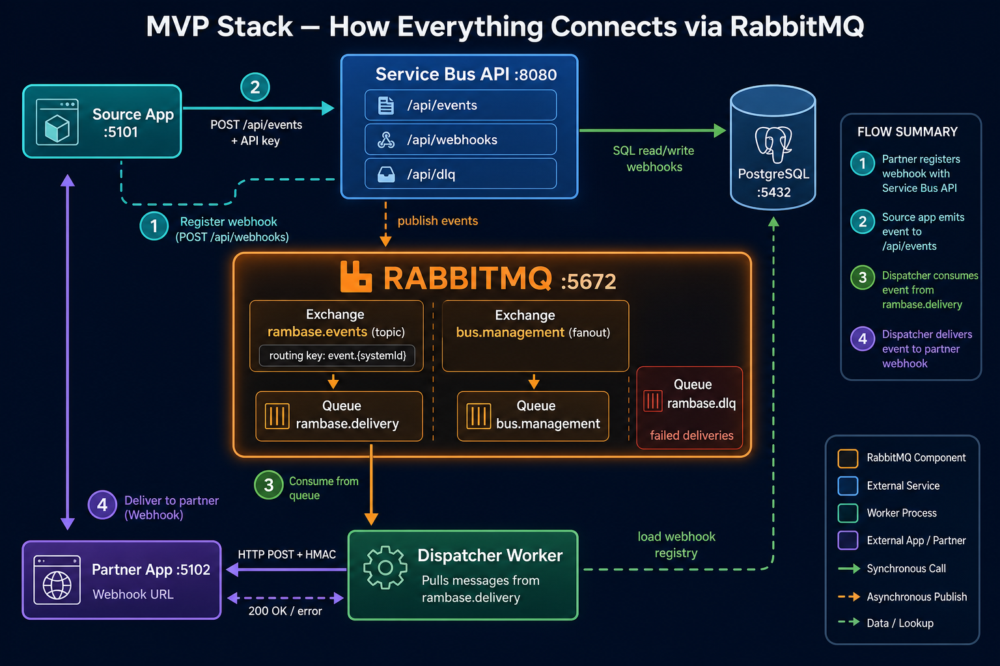

# MVP Visual Architecture Guide

> **Prefer visuals over walls of text.** AI-generated diagrams live in `diagrams/mvp/visuals/`. ASCII sources remain in `diagrams/mvp/` for git diffs.

## Service Bus 2.0 — five planes

| Plane | Role |
|-------|------|
| **Ingestion** | Normalize RamBase events; track publish cursor |
| **Messaging** | RabbitMQ — buffer + route (MVP broker; program decision still pending) |
| **Registration** | Webhook registry + Postgres |
| **Delivery** | Dispatcher → filter → HTTPS POST |
| **Observability** | Health, metrics, DLQ |

## Why RabbitMQ sits in the middle

## How components connect (MVP)

| Step | Who | RabbitMQ usage |
|------|-----|----------------|
| ① Register | Partner → API | `bus.management` fanout → `bus.management` queue |
| ② Emit | Source → API | Publish to `rambase.events` · routing `event.{systemId}` |
| ③ Consume | Dispatcher | Pull from `rambase.delivery` queue |
| ④ Deliver | Dispatcher → Partner | HTTP POST (outside broker); ack or nack |
| ✗ Fail | Dispatcher | After retries → `rambase.dlq` + Postgres mirror |

| Without broker | With RabbitMQ |
|----------------|---------------|
| Publisher waits on every partner | Publish once, move on |
| Partner down = block or drop | Queue holds events |
| Retries tangled in poller | Ack / nack / DLQ in dispatcher |
| Bursts hit partners directly | Buffer absorbs spikes |

**One line:** RabbitMQ is the **shock absorber** between RamBase event production and partner webhook delivery — decouple, buffer, retry.

> Broker choice for production is **not final** — see [[broker-decision-pending]]. RabbitMQ is the MVP stand-in that proves the spine.

## Runnable stack

See [[mvp-deployment-architecture]] · `prototype/` · `diagrams/mvp/01-platform-overview.md`

## Relationships

- [[mvp-visual-architecture-guide]] --illustrates--> [[proposed-component-model]]
- [[mvp-visual-architecture-guide]] --uses--> [[rabbitmq-routing-options]]
- [[mvp-visual-architecture-guide]] --contrasts_with--> [[10-Knowledge/Architecture/event-delivery-flow]]
