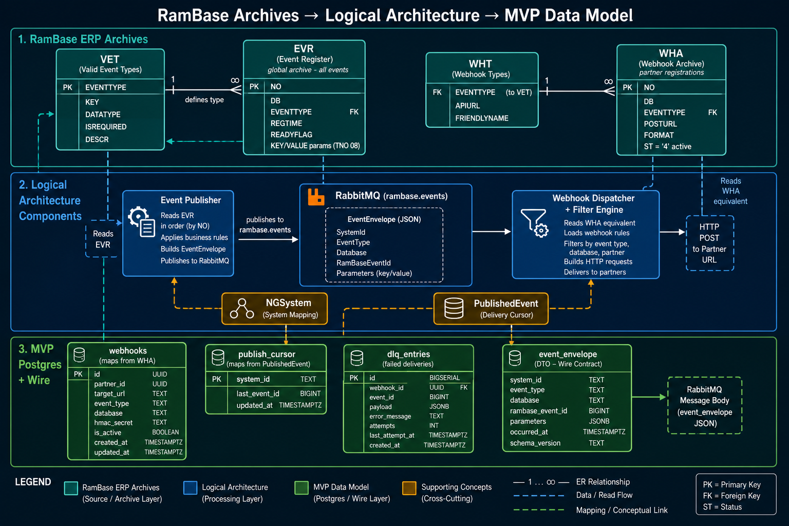

# Entity Model — Archives → Logical Architecture



> **Field-level detail:** [[10-Knowledge/Architecture/archive-structures-visual]]

## RamBase archives (ERP)

| Archive | Role | Key fields |
|---------|------|------------|
| **VET** | Event type catalog | `EVENTTYPE`, param defs (`KEY`, `DATATYPE`) |
| **EVR** | Event occurrence stream | `NO`, `DB`, `EVENTTYPE`, `REGTIME`, `KEY`/`VALUE` |
| **WHT** | Webhook-eligible types + API templates | `EVENTTYPE`, `APIURL` |
| **WHA** | Partner webhook registrations | `POSTURL`, `DB`, `EVENTTYPE`, `FORMAT` |

```text
VET ──defines──► EVR          (event must match valid type)
VET ──defines──► WHT ──templates──► WHA
EVR ──poll──► Publisher       WHA ──filter──► Dispatcher
```

## Control & routing stores

| Store | Role | MVP equivalent |
|-------|------|----------------|
| **NGSystem** (Repository) | System ↔ bus mapping, API creds | Simulated `SystemId` in MVP |
| **PublishedEvent** (ServiceBus DB) | Publish cursor per system | `publish_cursor` |
| **Broker** (Azure SB → RabbitMQ) | Message buffer + routing | `EventEnvelope` on `rambase.events` |

## MVP Postgres entities

| Table | Maps from | Used by |
|-------|-----------|---------|
| `webhooks` | WHA | API register · Dispatcher filter |
| `publish_cursor` | PublishedEvent | API on emit |
| `dlq_entries` | (new) failed delivery audit | Admin API |

## Wire contract

`EventEnvelope` = normalized EVR row on the broker:

| Envelope field | Archive source |
|----------------|----------------|
| `RamBaseEventId` | EVR.`NO` |
| `EventType` | EVR.`EVENTTYPE` |
| `Database` | EVR.`DB` |
| `RegisterTime` | EVR.`REGTIME` |
| `Parameters` | EVR `KEY`/`VALUE` (TNO 08) → `P_*` legacy |

## Relationships

- [[entity-model-archives-architecture]] --maps_to--> [[proposed-component-model]]
- [[entity-model-archives-architecture]] --preserves_contract_from--> [[10-Knowledge/Architecture/data-architecture]]
- [[entity-model-archives-architecture]] --implements_in--> [[mvp-visual-architecture-guide]]
- [[entity-model-archives-architecture]] --gap--> [[proposed-data-model-gap]]
